```{r}
#| label: setup
#| include: false

library(tidyverse)
library(knitr)

tb <- function(n) readr::read_csv(file.path("output/tablas", paste0(n, ".csv")),
                                  show_col_types = FALSE)

n_fmt <- function(x, d = 0) {
  format(round(x, d), big.mark = ".", decimal.mark = ",", nsmall = d,
         trim = TRUE, scientific = FALSE)
}
p_fmt <- function(x, d = 1) paste0(n_fmt(100 * x, d), "%")

estructura   <- tb("t01_estructura")
faltantes    <- tb("t03_faltantes")
dist_ped     <- tb("t04_distribucion_pedidos")
promo        <- tb("t05_promocion")
fuerza       <- tb("t06_fuerza_stl")
adf          <- tb("t07_adf")
correl       <- tb("t08_correlaciones")
elast        <- tb("t08b_elasticidad_pooled_within")
concen       <- tb("t08c_concentracion_descuento")
espec        <- tb("t09_especificaciones")
glance_mod   <- tb("t10_glance_modelos")
prec_vent    <- tb("t11_precision_ventana")
prec_cv      <- tb("t12_precision_cv")
lb           <- tb("t15_ljung_box")
coef_ax      <- tb("t16_coeficientes_arimax")
efectos      <- tb("t17_efectos_economicos")
res_cat      <- tb("t19_resumen_categorias")
res_com      <- tb("t21_resumen_combos")
mejora       <- tb("t22_mejora_por_nivel")
var_reg      <- tb("t24_variacion_regresores")
proy_tot     <- tb("t27_proyeccion_total")
dif_mod      <- tb("t28_diferencia_modelos_forecast")
proy_cat     <- tb("t30_proyeccion_categorias_resumen")

g <- function(tab, mod, col) tab[[col]][tab$.model == mod]
```

# Resumen ejecutivo {.unnumbered}

Este trabajo analiza el historial de pedidos semanales de una empresa de reparto
de comida que opera 77 centros de distribución y un catálogo de 51 platos, y
construye un sistema de pronóstico a diez semanas para apoyar la planificación de
la compra de insumos perecederos y la dotación de personal. El dataset proviene
de una competencia pública de Kaggle y contiene 456.548 observaciones semanales
que cubren 145 semanas de operación.

La técnica aplicada es **modelado de series de tiempo ARIMA / SARIMA / ARIMAX**,
implementada con el ecosistema `tsibble` / `fable` del tidyverse. El trabajo
llega a tres resultados importantes, a saber:

1. **La evaluación con una sola ventana de backtesting elige el modelo
   equivocado.** El pronóstico ingenuo (modelo 'naive' que consiste en repetir
   el último valor observado) gana con holgura en la ventana de validación de
   diez semanas, pero cae al quinto puesto de seis cuando el ejercicio se repite
   con validación cruzada de origen móvil. Todo el diseño de evaluación del
   trabajo se apoya en esa corrección.

2. **Forzar un componente estacional no mejora nada.** Con 2,8 años de historia,
   la búsqueda automática elige exactamente el mismo modelo con y sin
   estacionalidad anual habilitada. O sea, la estacionalidad no se impone.

3. **Incorporar las decisiones comerciales de la empresa (precios y promociones)
   mejora el pronóstico solo en un nivel de agregación intermedio.** Gana en 11
   de 12 categorías de producto, pero pierde tanto en el agregado total como en
   las series individuales centro-plato. La razón es que, para que tengan
   efecto, los regresores tienen que continuar siendo variables en el período
   que se quiere proyectar, y en las semanas proyectadas eso no ocurre sobre
   las combinaciones analizadas.

\newpage

# Parte 1 --- Elección del dataset y de la técnica

## Elección del dataset y motivación

El dataset elegido es **Food Demand Forecasting**, publicado en Kaggle a partir
de un problema real de la plataforma de competencias Analytics Vidhya. Describe
la operación de una empresa de reparto de comida que atiende múltiples ciudades
a través de centros de distribución propios. Cada fila del archivo principal
registra, para una semana determinada, cuántos pedidos recibió un determinado plato en un centro particular, junto con el precio que efectivamente se cobró, el precio de lista y dos indicadores de acción promocional, a saber: promoción por e-mail y destacado en la página de inicio de la web.

```{r}
#| label: tbl-estructura
#| tbl-cap: "Archivos que componen el dataset"
estructura |>
  mutate(filas = n_fmt(filas),
         archivo = str_remove(archivo, "\\.csv$"),
         contenido = str_wrap(contenido, 44)) |>
  select(archivo, filas, columnas, contenido) |>
  rename(Archivo = archivo, Filas = filas, Vars. = columnas,
         Contenido = contenido) |>
  kable(align = "lrrl", booktabs = TRUE)
```

La pregunta sustantiva es operativa y está enunciada por la propia empresa de la
siguiente manera: **¿cuántos pedidos va a recibir cada centro en las próximas diez
semanas?** Motiva la pregunta dos razones económicas. La primera
es que la materia prima es perecedera y se repone semanalmente. Sobreestimar la
demanda generaría desperdicio, y subestimarla generaría quiebres de stock y ventas
perdidas. La segunda es que la dotación de personal de cada centro se planifica,
de modo que un pronóstico sesgado se traduce en costo laboral ocioso o en demoras de entrega.

A esa pregunta operativa se agrega una segunda, de naturaleza econométrica,
que los datos permiten responder: **¿cuánto aporta conocer el plan comercial de
la empresa (sus precios y sus promociones) para anticipar la demanda?** Los daots
permiten repsonder esta pregunta porque los precios y las promociones de las semanas
a proyectar están disponibles, como decisiones que la empresa ya tomó. Eso permite
un ejercicio de pronóstico con variables exógenas genuinamente conocidas, sin
tener que suponer nada sobre su trayectoria futura.

El tamaño del dataset es holgado para un análisis exploratorio serio. Son 456.548 observaciones,
nueve variables en el archivo principal y dos tablas de dimensiones que agregan
la categoría y el tipo de cocina de cada plato, y la ciudad, la región, el tipo y
el área de operación de cada centro.

## Elección del método

A continuación, se justifica la elección del método utilizado para resolver el
problema, explicando también el descarte de otras técnicas econométricas disponibles.

- **Series de tiempo (elegida).** La variable dependiente es un conteo semanal
  indexado por un período regular, sin huecos a nivel agregado, y la necesidad
  es una proyección a un horizonte fijo de diez semanas.
  Además, la disponibilidad de los regresores en el período a proyectar habilita
  un ARIMAX.

- **Regresión lineal con regularización.** Sería aplicable si el objetivo fuera
  explicar el nivel de pedidos con un conjunto grande de covariables, pero
  ignoraría por completo la dependencia temporal. Con 145 semanas y menos de diez
  predictores, no existe el problema de dimensionalidad que motiva la aplicación
  de otros métodos como Ridge o LASSO.

- **Regresión logística y modelos lineales generalizados.** No hay ninguna
  variable binaria que sea la respuesta de interés. Un GLM Poisson o binomial
  negativo sería defendible para modelar el conteo de pedidos, pero sin
  estructura temporal explícita perdería lo que define al problema.

- **Datos de panel.** Esta era una alternativa seria porque el dataset es un panel:
  3.597 combinaciones centro-plato observadas hasta 145 veces. 
  Un modelo de efectos fijos respondería preguntas del tipo "¿cuánto aumenta la 
  demanda de un plato cuando se lo destaca en la página principal, controlando 
  por todo lo invariante de ese plato y ese centro?". Es una pregunta legítima, pero **de identificación, no de proyección**.
  Como la pregunta del problema es de proyección, la técnica correcta es la de
  series de tiempo. No obstante, en la Parte 3 se recupera parcialmente la dimensión de panel, estimando el modelo por separado en varios niveles de agregación.

## Utilización del paquete `fable` y no `forecast`

En clase la modelización de series de tiempo se trabajó con objetos `ts` y el
paquete `forecast` (`auto.arima`, `checkresiduals`, `forecast`). Este trabajo usa
`tsibble` y `fable`, la generación siguiente de los mismos autores. La técnica
econométrica es idéntica (ARIMA, SARIMA, ARIMAX, con la misma selección
automática por criterios de información) y el cambio es de implementación, por
cuatro razones prácticas:

1. **Consistente con la sintaxis de tidyverse** `fable` provee herramientas para 
   evaluar, visualizar y combinar modelos en un flujo de trabajo coherente con
   `tidyverse`, que es una colección de paquetes de R que comparten una filosofía de
   diseño y estructuras de datos comunes.

2. **El dataset es un panel, no una serie.** `fable` estima el mismo modelo sobre
   todas las series de un `tsibble` con clave múltiple en una sola llamada. Un
   objeto `ts` obliga a escribir un bucle sobre cada serie.

3. **Los faltantes son explícitos.** `tsibble` distingue entre "no hay registro"
   y "hay un cero", que es precisamente la distinción central del análisis
   exploratorio de este dataset.

4. **La comparación de modelos es nativa.** `accuracy()` sobre varios modelos y
   varias series, y `stretch_tsibble()` para validación cruzada de origen móvil,
   son parte del flujo estándar del paquete.

\newpage

# Parte 2 --- Análisis exploratorio

## Estructura general

El panel cubre 145 semanas consecutivas, pero sin fechas de calendario, porque el dataset
identifica los períodos con un índice entero de 1 a 145. Para poder hablar de
frecuencia semanal y habilitar modelos con componente estacional anual, anclamos
la semana 1 a la primera semana de 2016. Es una convención de indexado que no
altera ningún resultado.

La combinación de 77 centros y 51 platos admite 3.927 pares posibles, de los
cuales se observan 3.597 (el 91,6%). La variable dependiente es `num_orders`, el
número de pedidos de la semana, y las variables candidatas a regresor son el
precio cobrado, el precio de lista y dos indicadores binarios de promoción.

## La serie a pronosticar

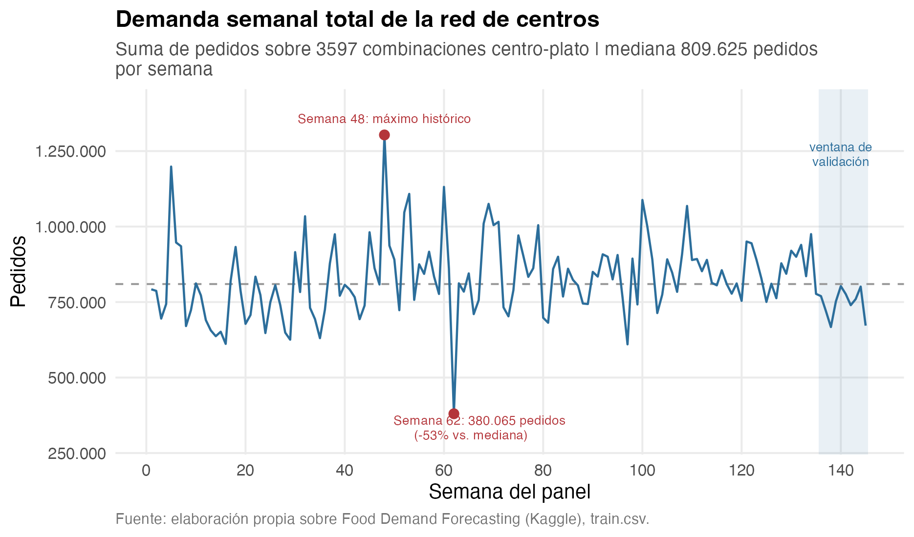{width=100%}

La demanda total semanal oscila alrededor de una mediana de
`r n_fmt(809625)` pedidos, sin tendencia marcada y con una variabilidad
considerable. Dos episodios saltan a la vista: el máximo de la semana 48 y,
más importante aún, la caída de la semana 62, que tuvo `r n_fmt(380065)` pedidos,
un 53% por debajo de la mediana.

## Valores faltantes

Ninguna columna del dataset tiene valores faltantes (`NA`). Sin embargo, el problema de
datos faltantes existe y es el hallazgo estructural más importante del análisis
exploratorio: **el panel es desbalanceado**. De las 3.597 combinaciones
centro-plato observadas, solo `r n_fmt(faltantes$combos[1])` tienen las 145
semanas completas.

```{r}
#| label: tbl-faltantes
#| tbl-cap: "Estructura de la ausencia de registros en el panel"
faltantes |>
  mutate(combos = n_fmt(combos), porcentaje = paste0(n_fmt(porcentaje, 1), "%")) |>
  rename(Situación = situacion, Combinaciones = combos, `% del total` = porcentaje) |>
  kable(align = "lrr")
```

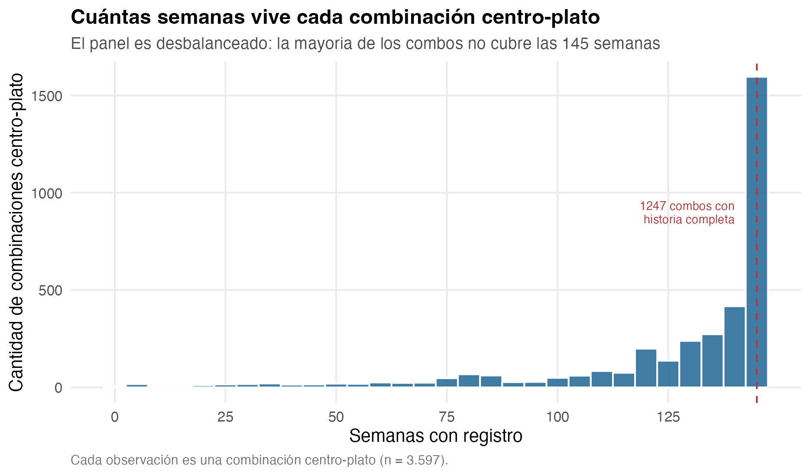{width=90%}

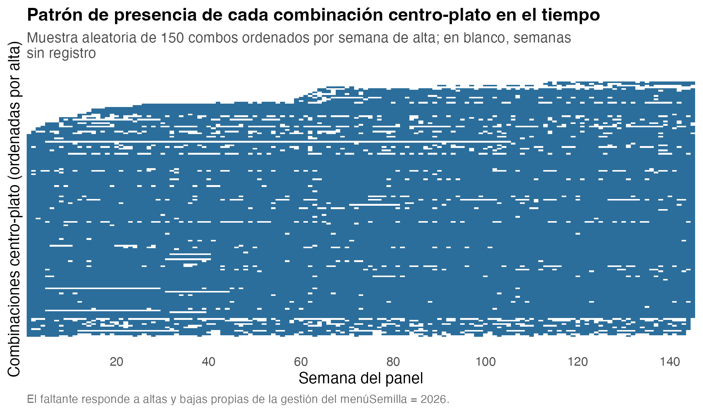{width=100%}

La segunda figura muestra que el el patrón de faltantes no es aleatorio. 
La escalera que se forma en el borde superior ccorresponde a platos dados de alta
progresivamente; los cortes horizontales y largos, a platos discontinuados y reincorporados.
Parece un comportamiento consistente con la gestión de un menú, no con un problema de recolección.

A pesar de los valores faltantes implícitos, se decidió no imputar ceros. La decisión es
verificable en los datos: el mínimo de `num_orders` en todo el dataset es
`r dist_ped$min`, nunca cero. Si la ausencia de un registro significara "se ofreció y no
se vendió", deberían existir registros con valor cero. Que no existan indica que
su ausencia significa que el plato no estaba disponible en ese centro esa semana.
Imputar ceros introduciría demanda falsa y sesgaría a la baja toda estimación.

En consecuencia, la estrategia de modelado evita el problema por diseño en lugar
de taparlo con una imputación: se trabaja en niveles de agregación donde la suma
se toma sobre los platos efectivamente ofrecidos (de modo que el faltante no
genera un hueco en la serie, que torna inaplicables algunos métodos), y cuando 
se baja al nivel individual se usan únicamente combinaciones con historia completa.
Como control adicional, la cantidad de ítems activos por semana entra al modelo 
como variable explicativa, de manera que la expansión del catálogo no se confunda
con crecimiento de la demanda por ítem.

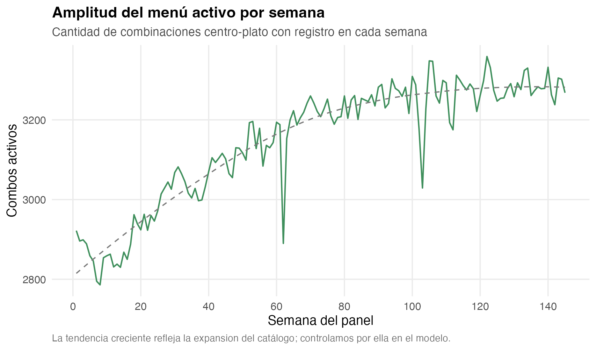{width=90%}

A nivel de categoría el mismo fenómeno aparece con una granularidad mayor: `Fish`
recién aparece en la semana 59 y `Salad` tiene un hueco de tres semanas. Ambas se
excluyen del modelado comparativo por categoría, para que la comparación entre
familias se haga sobre la misma ventana temporal. Representan en conjunto el 9,9%
del volumen histórico, y se las tiene en cuenta al evaluar la coherencia entre
niveles en la Parte 3.

## Distribución de la variable dependiente

```{r}
#| label: tbl-dist
#| tbl-cap: "Distribución de los pedidos semanales por combinación centro-plato"
dist_ped |>
  mutate(across(everything(), ~ n_fmt(.x, 0))) |>
  rename(Mínimo = min, `P25` = p25, Mediana = mediana, Media = media,
         `P75` = p75, `P99` = p99, Máximo = max, Asimetría = asimetria) |>
  kable(align = "rrrrrrrr")
```

La distribución es fuertemente asimétrica: la mediana es de `r dist_ped$mediana`
pedidos, el percentil 99 de `r n_fmt(dist_ped$p99)` y el máximo de
`r n_fmt(dist_ped$max)`. El coeficiente de asimetría es de
`r n_fmt(dist_ped$asimetria, 1)`.

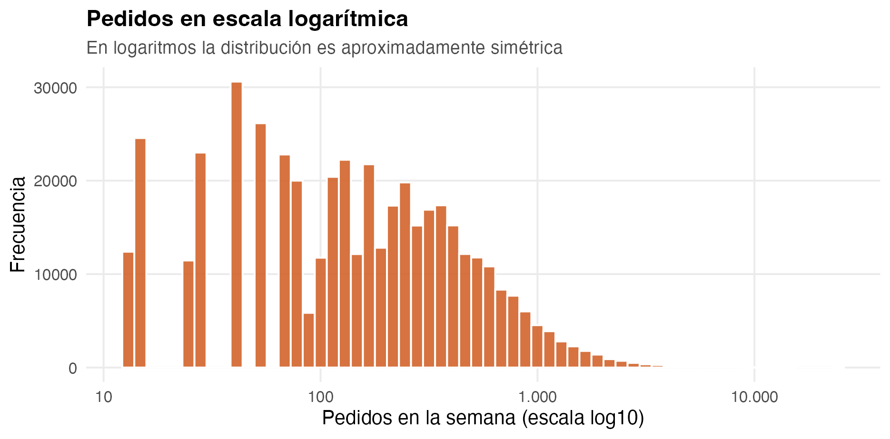{width=85%}

En logaritmos la distribución se vuelve aproximadamente simétrica. Por esta razón,
todos los modelos de la Parte 3 se estiman sobre el logaritmo de los pedidos.
La transformación no es cosmética; cumple tres funciones. Garantiza proyecciones 
estrictamente positivas, hace que los errores sean proporcionales al nivel de la 
serie (errar por mil pedidos no significa lo mismo en una serie de
cinco mil que en una de doscientos mil), y convierte los coeficientes en
efectos porcentuales, que es la unidad en que se toman las decisiones comerciales.

Finalmente, los valores extremos no se eliminan. Las observaciones de la cola
derecha corresponden a los platos más vendidos en los centros más grandes durante
semanas de promoción. Son demanda real y son justamente las que más importa
proyectar bien. La escala logarítmica ya limita su influencia sobre la
estimación.

## Precios y descuentos

La variable de precios más informativa es el descuento efectivo, definido como la
diferencia relativa entre el precio de lista y el precio cobrado. Al construirla
aparece algo que cabe notar: **en el 25,4% de las filas el precio cobrado es mayor
que el precio de lista**, de modo que el descuento es negativo, y llega hasta un 
recargo del 73%.

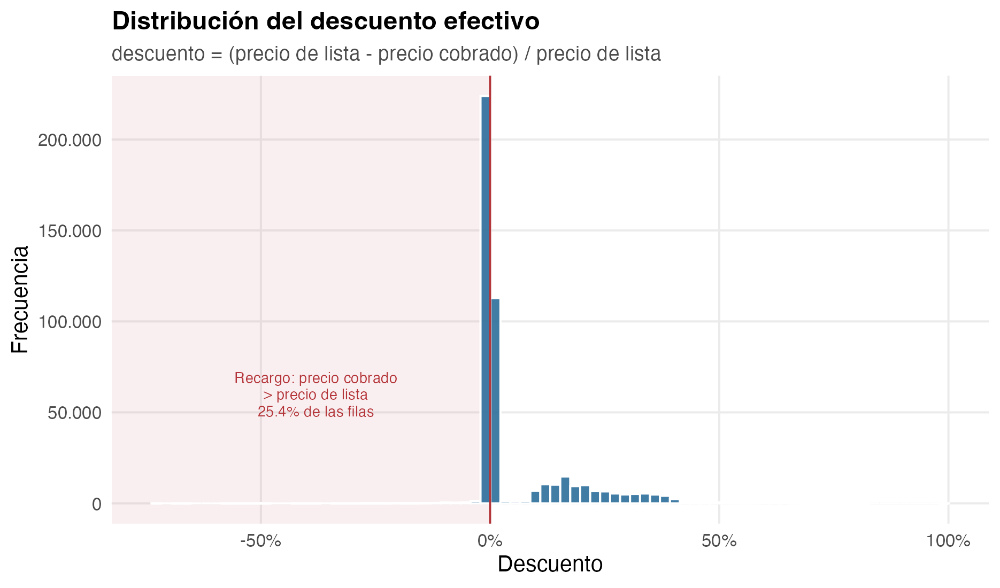{width=95%}

Aún así, los valores negativos se conservaron con su signo. No son un
error de carga sino una política de precios. Posiblemente, la empresa cobra por encima del
precio de referencia en un cuarto de las transacciones, lo que es consistente con
sobreprecios por franja horaria, por zona o por demanda alta. Truncarlos en cero
descartaría exactamente la mitad de la variación de precios disponible, que es
la que permite estimar cómo responde la cantidad al precio. La alternativa
(tratar los recargos como categoría aparte) se descartó por simplicidad y
porque los datos no la sostendrían: los recargos que superan el 2% son apenas el
`r n_fmt(sum(concen$porcentaje[1:2]), 1)`% de las filas, y los que superan el 25%
son 111 observaciones sobre 456.548. No hay masa suficiente para estimar una
respuesta separada del lado de los aumentos de precio.

## Relaciones bivariadas relevantes para la técnica

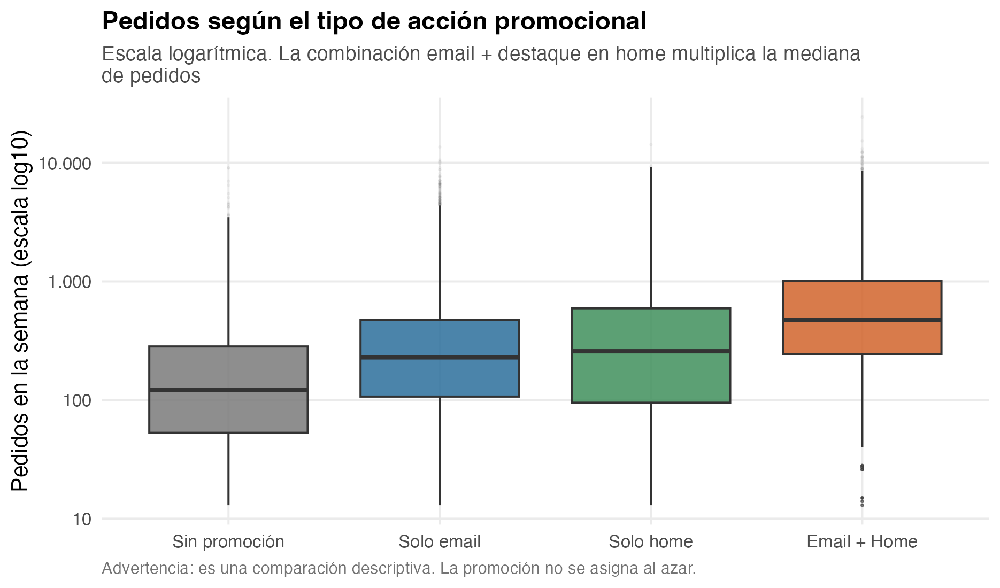{width=95%}

La mediana de pedidos pasa de `r promo$mediana_pedidos[1]` sin ninguna acción
promocional a `r promo$mediana_pedidos[4]` cuando se combinan campaña de correo
y destaque en la página principal, prácticamente se cuadruplica. No obstante, se
debe interpretar con cautela: la promoción no se asigna al azar, y es razonable 
pensar que la empresa promocione justamente los platos que espera vender bien.
De todas formas, sugiere que hay señal suficiente para justificar un modelo con regresores.

La segunda relación bivariada que interesa es la que hay entre el precio y la
cantidad, y exige una advertencia metodológica antes de mirarla. El descuento
está definido en relación al precio de lista de cada plato, pero los pedidos
están en niveles absolutos, y los niveles varían enormemente entre productos: la
mediana es de `r dist_ped$mediana` pedidos y el máximo de `r n_fmt(dist_ped$max)`.
Un gráfico que junte las 3.597 combinaciones centro-plato está comparando
productos distintos entre sí, y esa variación de escala aplasta la respuesta al
precio, que es un fenómeno de cada producto consigo mismo a lo largo del tiempo.

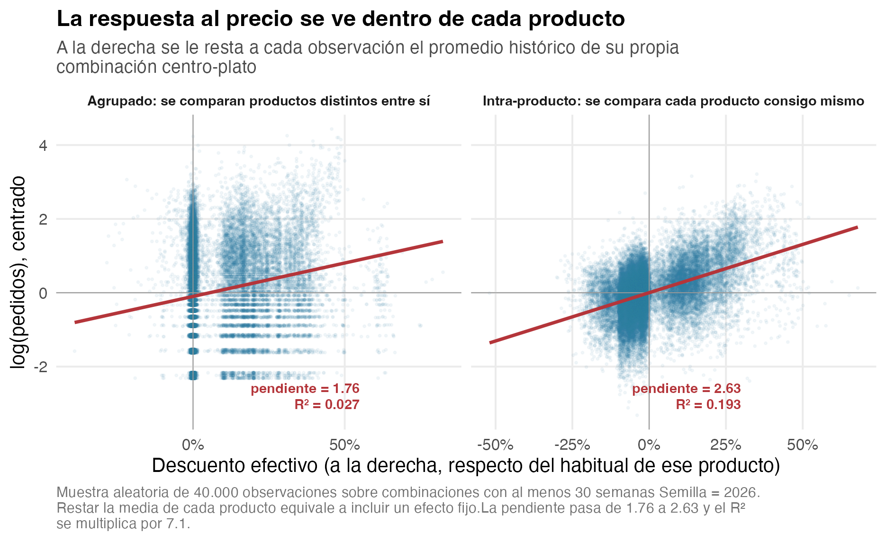{width=100%}

La figura muestra las dos lecturas una al lado de la otra. En el panel izquierdo,
agrupando todo, la nube es difusa: la pendiente es de
`r n_fmt(elast$beta[1], 2)` pero el ajuste explica apenas el
`r n_fmt(100 * elast$r2[1], 1)`% de la variación. En el panel derecho, donde a
cada observación se le resta el promedio histórico de su propia combinación
centro-plato (lo que equivale a incluir un efecto fijo por producto), la
relación aparece con nitidez: la pendiente sube a `r n_fmt(elast$beta[2], 2)` y el
poder explicativo se multiplica por
`r n_fmt(elast$r2[2] / elast$r2[1], 1)`, hasta el
`r n_fmt(100 * elast$r2[2], 1)`%. La correlación pasa de
`r n_fmt(elast$correlacion[1], 2)` a `r n_fmt(elast$correlacion[2], 2)`.

La lectura sustantiva es que **la demanda sí responde al precio,
pero esa respuesta es intra-producto y un análisis agrupado la esconde**. Es el
mismo fenómeno de variable omitida que aparece cuando se ignora una dimensión
relevante de los datos: el nivel medio de cada plato está correlacionado tanto con
sus pedidos como con su política de precios, de modo que no controlarlo sesga la
estimación hacia cero.

Cabe notar dos precauciones adicionales sobre este gráfico:

La primera es que el descuento está muy concentrado: el `r n_fmt(concen$porcentaje[3], 1)`%
de las filas se mueve dentro de una banda de más o menos dos puntos porcentuales
alrededor de cero, que es la columna vertical visible en ambos paneles. Por eso se
usa un ajuste lineal y no un suavizado local (un LOESS sobre una variable tan
concentrada queda dominado en cada vecindad por esa columna y devuelve una curva
plana que no informa nada, y en la zona de recargos profundos, donde hay unos
pocos cientos de observaciones, directamente extrapola ruido).

La segunda es que el descuento a veces está acompañado de la promoción. La proporción 
de ítems promocionados pasa del 4,6% entre los que no tienen descuento al 58,7% entre 
los que tienen más de 30%, de modo que parte de lo que mide esta pendiente es el efecto 
de la promoción que suele acompañar al descuento. Separar ambos efectos es precisamente
lo que hace el modelo con variables exógenas de la Parte 3, que los incluye juntos.

## Heterogeneidad entre categorías y centros

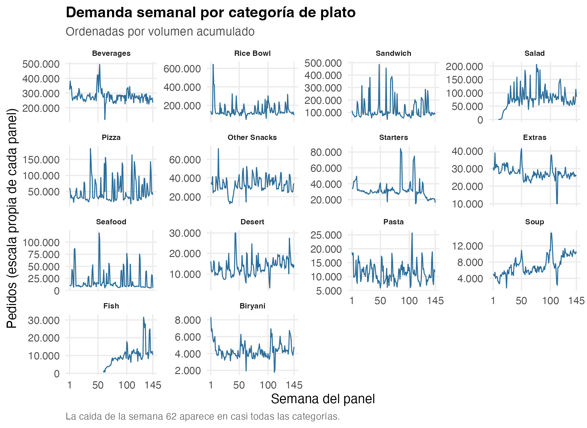{width=100%}

Las escalas son muy distintas: `Beverages` mueve alrededor de 280.000 pedidos
semanales y `Biryani` unos 4.400, lo que obliga a usar métricas de error
comparables entre series (MASE) y no solo el error cuadrático medio. En casi
todos los paneles se ve la misma caída sincronizada alrededor de la semana 62.

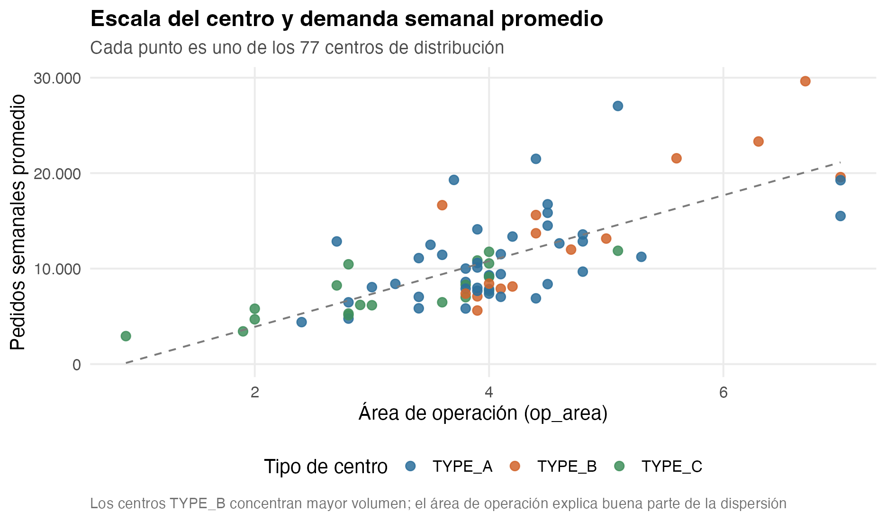{width=95%}

El área de operación del centro explica buena parte de la dispersión del volumen,
y los centros de tipo B concentran los mayores volúmenes pese a ser los menos
numerosos.

## Análisis de la caída de la semana 62

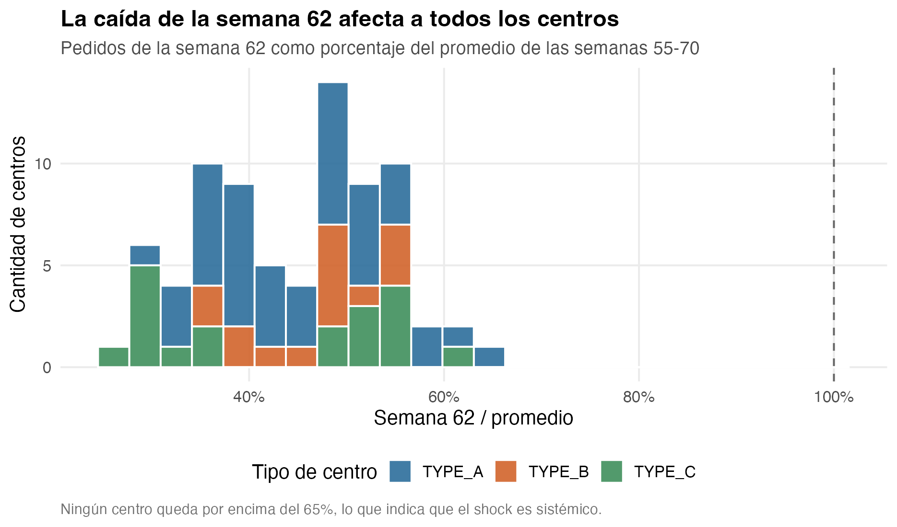{width=95%}

La caída de la semana 62 no es un valor atípico de la serie: **los 77 centros
caen simultáneamente más de un 30% respecto de su propio promedio local**, y
ninguno queda por encima del 65%. Un shock de demanda genuino no tiene por qué
afectar a todas las ciudades y todas las categorías en la misma semana y con la
misma intensidad. El patrón es compatible con una interrupción operativa de la
plataforma o con un problema de registro que afectó a toda la semana.

En este caso, el dato no se elimina ni se interpola, sino que se modela mediante
una variable de intervención, es decir, una variable indicadora que vale uno en
la semana 62 y cero en el resto. El razonamiento es que el episodio está
identificado, es de causa única y no es recurrente: borrarlo equivaldría a
pretender que no ocurrió, e interpolarlo inventaría un dato. Dejarlo sin tratar,
en cambio, inflaría la varianza residual del modelo y ensancharía artificialmente
todos los intervalos de pronóstico. La variable de intervención permite conservar
el dato y aislar su efecto. La estimación de ese efecto se reporta en la Parte 3.

## Propiedades de serie de tiempo

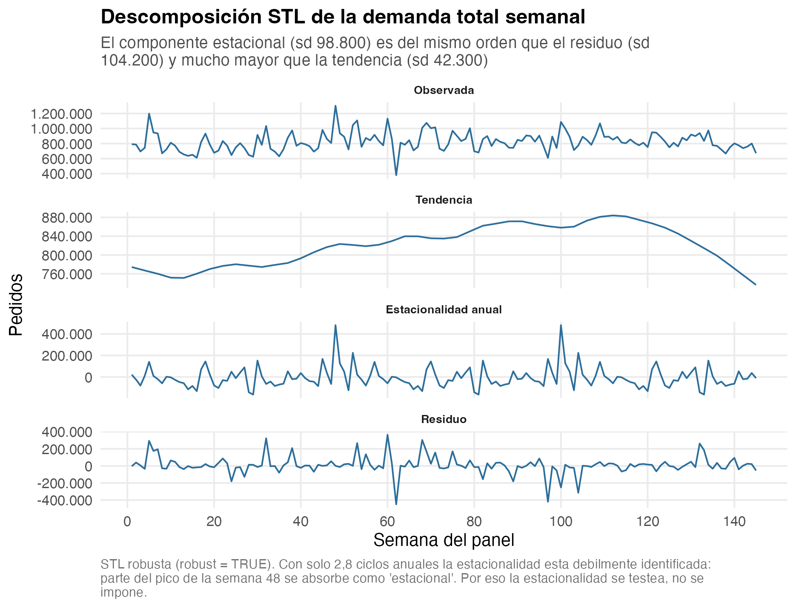{width=95%}

La descomposición muestra una tendencia muy débil (fuerza de tendencia
`r n_fmt(fuerza$trend_strength, 2)`) frente a un componente estacional de fuerza
`r n_fmt(fuerza$seasonal_strength_year, 2)` y un residuo del mismo orden de
magnitud que ese componente estacional. Con 145 semanas hay apenas 2,8 ciclos anuales, 
de modo que un patrón anual está débilmente identificado y parte de lo que la descomposición
atribuye a "estacionalidad" es en realidad un episodio puntual (el pico de la
semana 48) que no tiene por qué repetirse. Por eso en la Parte 3 la estacionalidad se 
somete a prueba en lugar de asumirse.

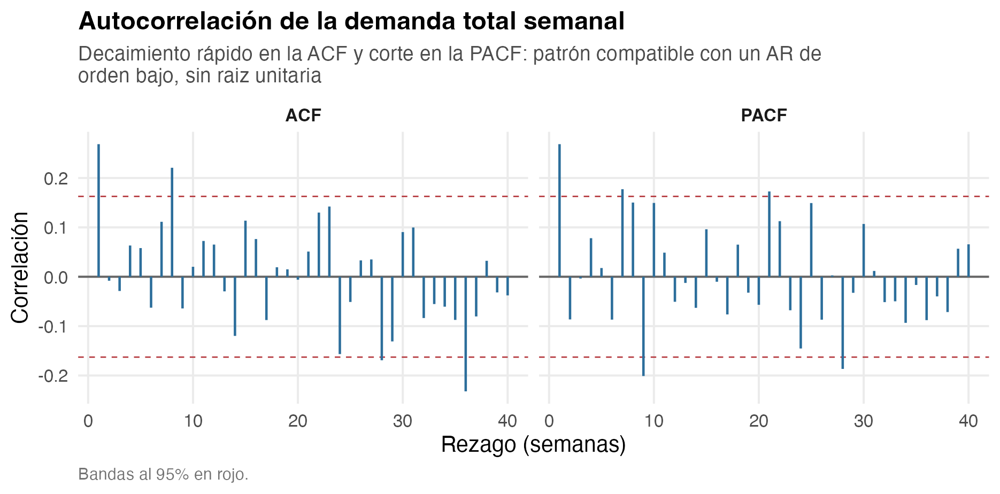{width=100%}

```{r}
#| label: tbl-adf
#| tbl-cap: "Test de Dickey-Fuller aumentado"
adf |>
  mutate(p_valor = n_fmt(p_valor, 2), estadistico = n_fmt(estadistico, 2)) |>
  rename(Serie = serie, Estadístico = estadistico, `p-valor` = p_valor,
         Conclusión = conclusion) |>
  kable(align = "lrrl")
```

La función de autocorrelación decae rápidamente y el test de Dickey-Fuller
aumentado rechaza la hipótesis de raíz unitaria en niveles. Esto implica que
la serie ya es estacionaria sin necesidad de diferenciar, de modo que un modelo 
que diferencie estaría sobre-diferenciando.

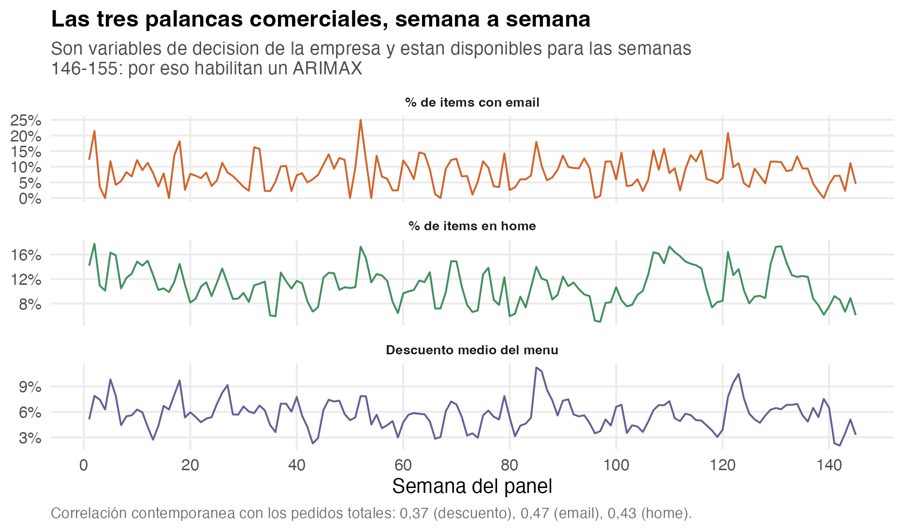{width=95%}

Las correlaciones contemporáneas de los pedidos totales con las tres palancas
comerciales son de `r n_fmt(correl$descuento_medio, 2)` con el descuento medio,
`r n_fmt(correl$share_emailer, 2)` con la proporción de ítems con campaña de
correo y `r n_fmt(correl$share_home, 2)` con la proporción de ítems destacados.
Son magnitudes suficientes para justificar un modelo con variables exógenas.

\newpage

# Parte 3 --- Aplicación de la técnica e interpretación

## Diseño de la evaluación

En esta parte se elige entre modelos. En series de tiempo la partición de los 
datos no puede ser aleatoria: el conjunto de validación tiene que ser posterior 
al de entrenamiento, porque de lo contrario el modelo usa información del futuro 
para predecir el pasado.

Se usan dos esquemas:

1. **Backtesting sobre una ventana.** Se estima con las semanas 1 a 135 y se
   proyectan las semanas 136 a 145, que existen en los datos pero que ningún
   modelo vio al estimarse. Este esquema replica el del problema original.

2. **Validación cruzada de origen móvil.** El mismo ejercicio se repite
   desplazando el punto de corte. Se entrena con las primeras noventa semanas, se
   proyectan diez, se avanza cinco semanas y se vuelve a empezar, hasta obtener
   once ventanas. Es el análogo temporal de la validación cruzada en $k$ bloques.

Los regresores del modelo con variables exógenas son conocidos en el período
proyectado en ambos esquemas. Constituyen las decisiones de precio y promoción 
que la empresa ya tomó y registró, y reproducen la situación real de planificación,
en la que el área comercial define el plan y logística proyecta la demanda 
condicional a ese plan.

## Modelos estimados

```{r}
#| label: tbl-espec
#| tbl-cap: "Especificación seleccionada automáticamente por cada modelo"
espec |>
  mutate(modelo = recode(modelo,
    arima = "ARIMA (orden de integración libre)",
    arima_d0 = "ARIMA estacionario (d = 0 impuesto)",
    sarima = "SARIMA (estacionalidad de período 52 habilitada)",
    arimax = "ARIMAX (con precios, promociones e intervención)")) |>
  rename(Modelo = modelo, `Especificación elegida` = especificacion) |>
  kable(align = "ll")
```

La tabla contiene el primero de los dos resultados metodológicos del trabajo. La
fila del SARIMA muestra que **al habilitar el componente estacional de período
52, la búsqueda automática elige exactamente el mismo modelo que sin él**:
`r espec$especificacion[espec$modelo == "sarima"]`, sin ninguna parte estacional.
El criterio de información no encuentra ganancia en la estacionalidad anual, lo
que es consistente con lo que anticipaba la descomposición: 2,8 ciclos no
alcanzan para identificar un patrón anual.

En relación a la segunda fila, cando el orden de integración se deja libre,
la selección automática de `fable` (que se basa en el test KPSS) elige
diferenciar una vez. Pero el test de Dickey-Fuller aumentado de la Parte 2
rechazaba la raíz unitaria, es decir, indicaba lo contrario. En lugar de elegir una,
se estiman ambas especificaciones y se deja que decida el error de proyección fuera de muestra.

## Resultado de la evaluación

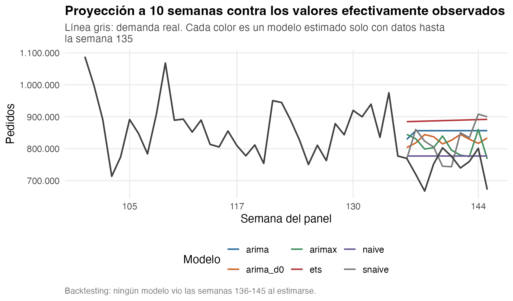{width=100%}

```{r}
#| label: tbl-comparacion
#| tbl-cap: "RMSE fuera de muestra bajo los dos esquemas de evaluación"
prec_vent |>
  select(.model, RMSE_ventana = RMSE) |>
  full_join(prec_cv |> select(.model, RMSE_cv = RMSE), by = ".model") |>
  arrange(RMSE_cv) |>
  mutate(across(c(RMSE_ventana, RMSE_cv), ~ ifelse(is.na(.x), "---", n_fmt(.x)))) |>
  rename(Modelo = .model, `RMSE ventana 136--145` = RMSE_ventana,
         `RMSE validación cruzada` = RMSE_cv) |>
  kable(align = "lrr")
```

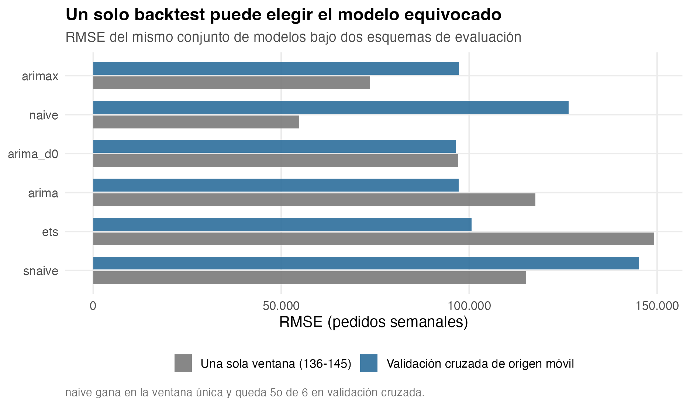{width=100%}

Éste es el segundo resultado metodológico, y es el que más condiciona todo lo que
sigue. **En la ventana única el ganador es el pronóstico ingenuo (naive)**, con un RMSE
de `r n_fmt(g(prec_vent, "naive", "RMSE"))` pedidos, muy por debajo de cualquier
modelo estimado. Esto lleva a concluir que ningún modelo aporta nada en comparación a
repetir el último valor observado.

No obstante, la validación cruzada muestra que esa conclusión depende de la ventana
elegida. Sobre once ventanas, el pronóstico ingenuo pasa a un RMSE de
`r n_fmt(g(prec_cv, "naive", "RMSE"))` pedidos (más del doble), y queda
quinto entre seis modelos. Lo que había ocurrido es que el nivel de la semana 135
resultó casi idéntico al promedio de las diez semanas siguientes, una coincidencia
que no se repite en otros cortes.

El modelo seleccionado es el **ARIMA estacionario**, con un RMSE de
`r n_fmt(g(prec_cv, "arima_d0", "RMSE"))` pedidos, equivalente a un error
porcentual absoluto medio de `r n_fmt(g(prec_cv, "arima_d0", "MAPE"), 1)`%. Nótese
que le gana al ARIMA con diferenciación automática: **el test de Dickey-Fuller
tenía razón y diferenciar era sobre-diferenciar**. La diferencia es modesta pero
consistente, y resuelve empíricamente la discrepancia entre los dos tests de raíz
unitaria.

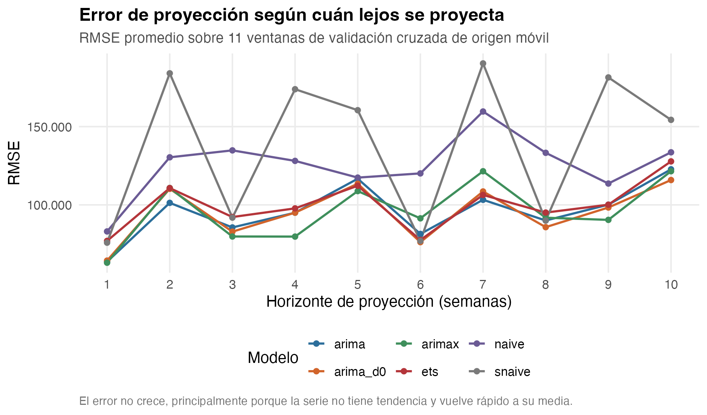{width=95%}

Una particularidad de esta serie: el error **no** crece con el horizonte de
proyección, a diferencia de lo que ocurre habitualmente. Esto es consecuencia
directa de la ausencia de tendencia: la serie revierte rápido a su media, de
modo que proyectar a diez semanas no es sustancialmente más difícil que proyectar
a dos. Esto sería una buena noticia operativa, porque la planificación a diez
semanas no es materialmente menos confiable que la planificación a dos semanas.

## Diagnóstico de residuos

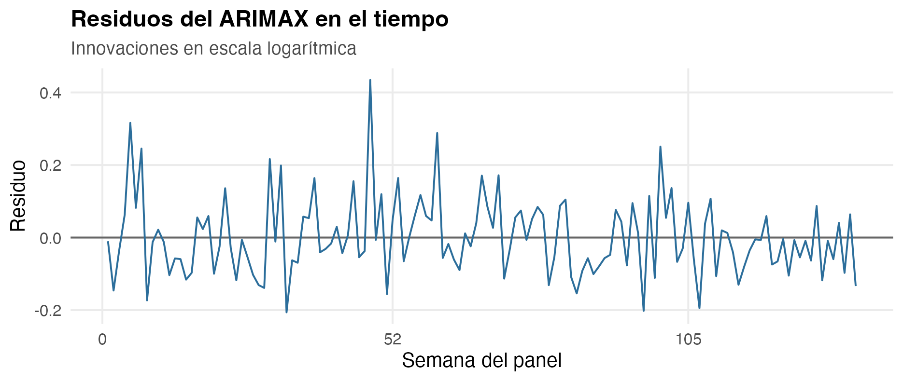{width=85%}

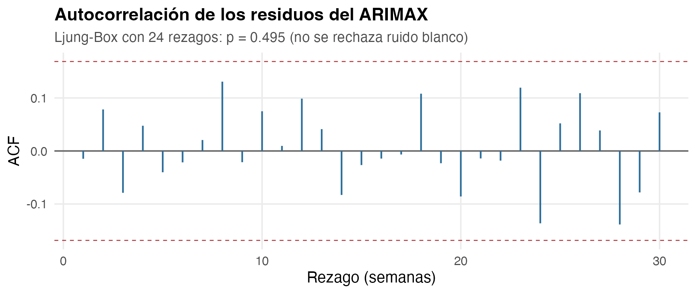{width=85%}

Se diagnostica el modelo con variables exógenas, que es el que responde la
pregunta económica del trabajo. Los residuos no muestran estructura visible ni
cambios de varianza, y la autocorrelación se mantiene dentro de las bandas de
confianza en todos los rezagos. El test de Ljung-Box con 24 rezagos arroja un
p-valor de `r n_fmt(lb$lb_pvalue, 2)`, de modo que no se rechaza la hipótesis de
que los residuos sean ruido blanco. El modelo no está dejando estructura temporal
sin aprovechar.

## Interpretación económica

```{r}
#| label: tbl-coef
#| tbl-cap: "Coeficientes del modelo con variables exógenas sobre el logaritmo de los pedidos"
coef_ax |>
  filter(term != "intercept") |>
  mutate(
    term = recode(term,
      ar1 = "Componente autorregresivo (AR1)",
      descuento_medio = "Descuento medio del menú",
      share_emailer = "Proporción de ítems con campaña de correo",
      share_home = "Proporción de ítems destacados en la página principal",
      n_items = "Amplitud del menú activo",
      sem62 = "Intervención de la semana 62"),
    estimate = n_fmt(estimate, 3),
    std.error = n_fmt(std.error, 3),
    p.value = ifelse(p.value < 0.001, "< 0,001", n_fmt(p.value, 3))
  ) |>
  select(term, estimate, std.error, p.value, signif) |>
  rename(Variable = term, Coeficiente = estimate, `Error estándar` = std.error,
         `p-valor` = p.value, ` ` = signif) |>
  kable(align = "lrrrl")
```

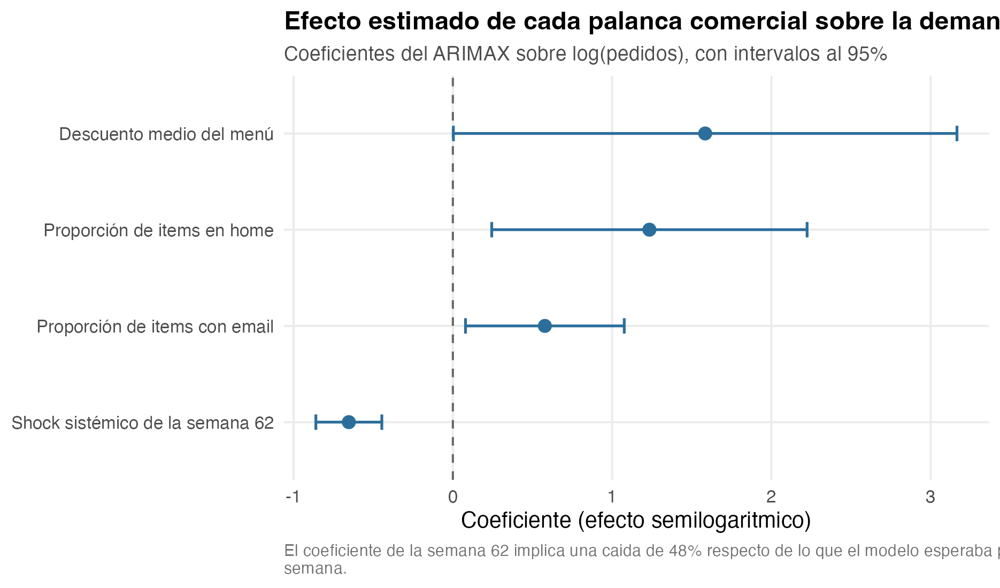{width=95%}

Como la variable dependiente está en logaritmos, cada coeficiente se lee como el
efecto porcentual aproximado de aumentar el regresor en una unidad. Los tres
coeficientes comerciales son positivos y significativos al 5% o al 10%, con el
signo que la teoría predice.

**El coeficiente de la intervención de la semana 62 es de
`r n_fmt(coef_ax$estimate[coef_ax$term == "sem62"], 2)`**, lo que implica una
caída del `r n_fmt(abs(coef_ax$efecto_pct[coef_ax$term == "sem62"]), 0)`% respecto
de lo que el modelo esperaba para esa semana dadas las condiciones comerciales
vigentes. Cerca de la mitad de la demanda semanal de toda la red.

Ahora bien, los coeficientes sobre los regresores comerciales están expresados
por unidad, y las unidades son proporciones entre cero y uno. Un aumento de una
unidad en "proporción de ítems con campaña de correo" significa pasar del 0% al
100% del menú, algo que la empresa nunca hizo. La lectura relevante es la que
traduce esos coeficientes a movimientos dentro del rango en que la empresa
efectivamente opera:

```{r}
#| label: tbl-efectos
#| tbl-cap: "Efecto de pasar del percentil 25 al percentil 75 de cada palanca comercial"
efectos |>
  mutate(
    term = recode(term,
      descuento_medio = "Descuento medio del menú",
      share_emailer = "Proporción de ítems con campaña de correo",
      share_home = "Proporción de ítems destacados"),
    delta_p25_p75 = paste0(n_fmt(100 * delta_p25_p75, 1), " p.p."),
    efecto_pct = paste0("+", n_fmt(efecto_pct, 1), "%"),
    p.value = n_fmt(p.value, 3)
  ) |>
  select(term, delta_p25_p75, efecto_pct, p.value) |>
  rename(Palanca = term, `Movimiento P25 → P75` = delta_p25_p75,
         `Efecto sobre la demanda` = efecto_pct, `p-valor` = p.value) |>
  kable(align = "lrrr")
```

De esta forma, **los efectos son estadísticamente significativos pero
económicamente modestos en el agregado**: entre 3% y 5% de la demanda total. La
razón es que la empresa mueve estas palancas dentro de un rango estrecho a nivel
de red: el rango intercuartil de la proporción de ítems con campaña de correo es
de apenas `r n_fmt(100 * efectos$delta_p25_p75[efectos$term == "share_emailer"], 1)`
puntos porcentuales. El efecto por unidad es grande, pero la variación observada es
pequeña.

Esto explica un resultado extraño: aunque el modelo
con variables exógenas ajusta mucho mejor dentro de muestra (su criterio de
información corregido es de `r n_fmt(g(glance_mod, "arimax", "AICc"), 0)` contra
`r n_fmt(g(glance_mod, "arima_d0", "AICc"), 0)` del modelo sin regresores), es decir,
**no mejora la proyección fuera de muestra a nivel agregado**: su RMSE en
validación cruzada es de `r n_fmt(g(prec_cv, "arimax", "RMSE"))` contra
`r n_fmt(g(prec_cv, "arima_d0", "RMSE"))`. Mejor ajuste dentro de muestra no
implica necesariamente mejor pronóstico fuera de ella.

## Nivel de agregación: ¿dónde sirve conocer el plan comercial?

El resultado anterior sugiere una hipótesis: la información promocional se diluye
al agregar sobre 3.597 combinaciones, porque las campañas individuales se
compensan entre sí. Si eso fuera cierto, el modelo con regresores debería mejorar
a medida que se desagrega. Se puso a prueba estimando el mismo par de modelos en
dos niveles adicionales: las doce categorías de plato con historia completa, y
las seis combinaciones centro-plato de mayor volumen.

```{r}
#| label: tbl-mejora
#| tbl-cap: "Desempeño del modelo con y sin variables exógenas en tres niveles de agregación"
mejora |>
  mutate(across(c(MASE_arima, MASE_arimax), ~ n_fmt(.x, 3)),
         mejora_pct = paste0(n_fmt(mejora_pct, 1), "%")) |>
  rename(Nivel = nivel, `MASE sin regresores` = MASE_arima,
         `MASE con regresores` = MASE_arimax, `Ganancia` = mejora_pct) |>
  kable(align = "lrrr")
```

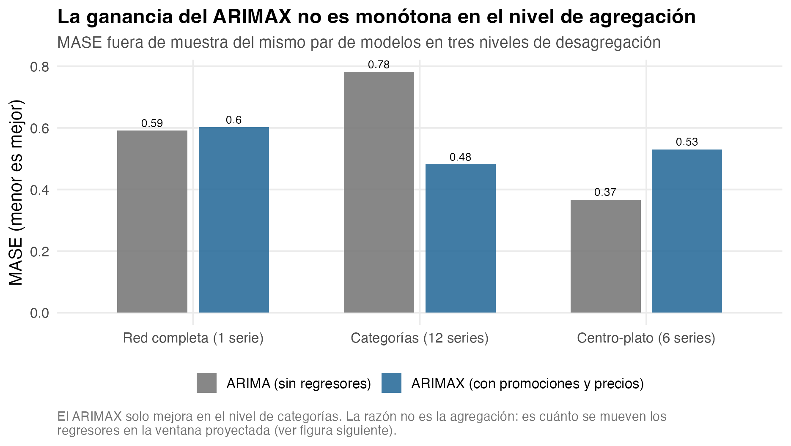{width=100%}

**La hipótesis se cumple parcialmente.** El modelo con regresores mejora de manera
contundente en el nivel intermedio: reduce el error un 38% y es el mejor
modelo en 9 de las 12 categorías, pero **empeora** en el nivel centro-plato,
que es el más desagregado de todos y donde la hipótesis predecía la mayor
ganancia.

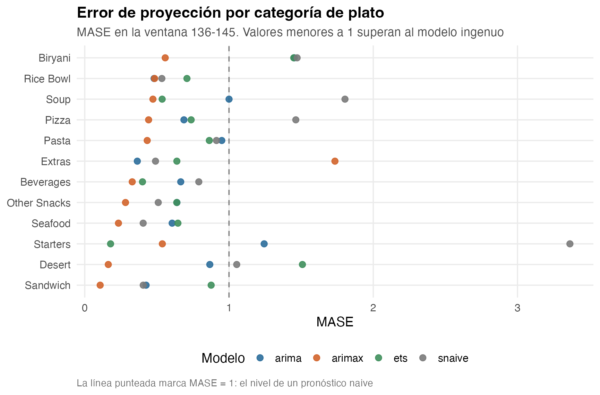{width=95%}

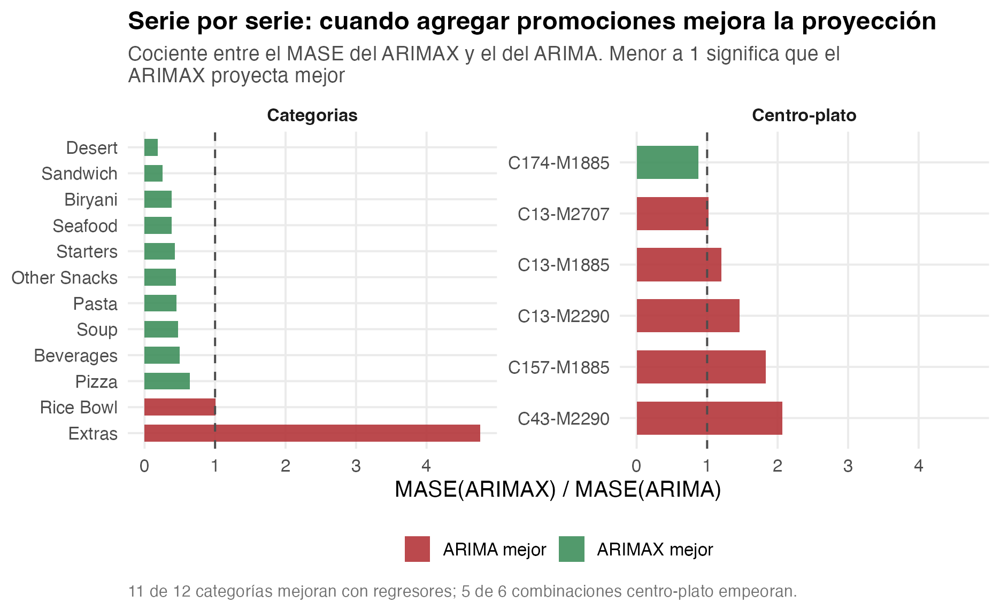{width=100%}

La explicación no está en el nivel de agregación, y se puede verificar en los datos:

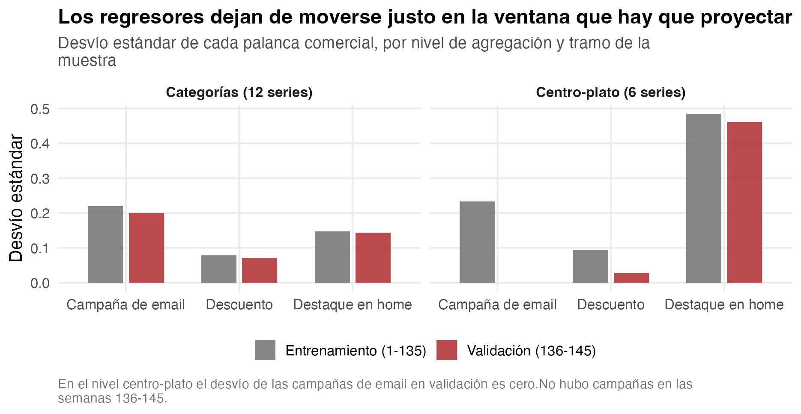{width=100%}

**En las semanas 136 a 145 la empresa no lanzó ni una sola campaña de correo
sobre ninguna de las seis combinaciones analizadas**. El desvío estándar de ese 
regresor en la ventana de validación es cero, y el de los descuentos cae de
`r n_fmt(var_reg$descuento[var_reg$nivel == "Centro-plato (6 series)" & grepl("Entrena", var_reg$tramo)], 3)`
a
`r n_fmt(var_reg$descuento[var_reg$nivel == "Centro-plato (6 series)" & grepl("Valida", var_reg$tramo)], 3)`. Es decir, el regresor es prácticamente constante.
A nivel de categoría, en cambio, los regresores siguen variando casi igual que
en el entrenamiento, porque agregan sobre muchos platos.

El principio que se desprende es más general que este caso particular: **un modelo con
variables exógenas no aporta por tener regresores significativos, sino porque esos
regresores varían en el período que se quiere proyectar.** Cuando no varían, los
parámetros adicionales solo aportan ruido de estimación, afectando la precisión del pronóstico. En el nivel centro-plato el costo es alto porque los coeficientes de
descuento son muy grandes, de modo que cualquier movimiento pequeño de precios se amplifica en la proyección.

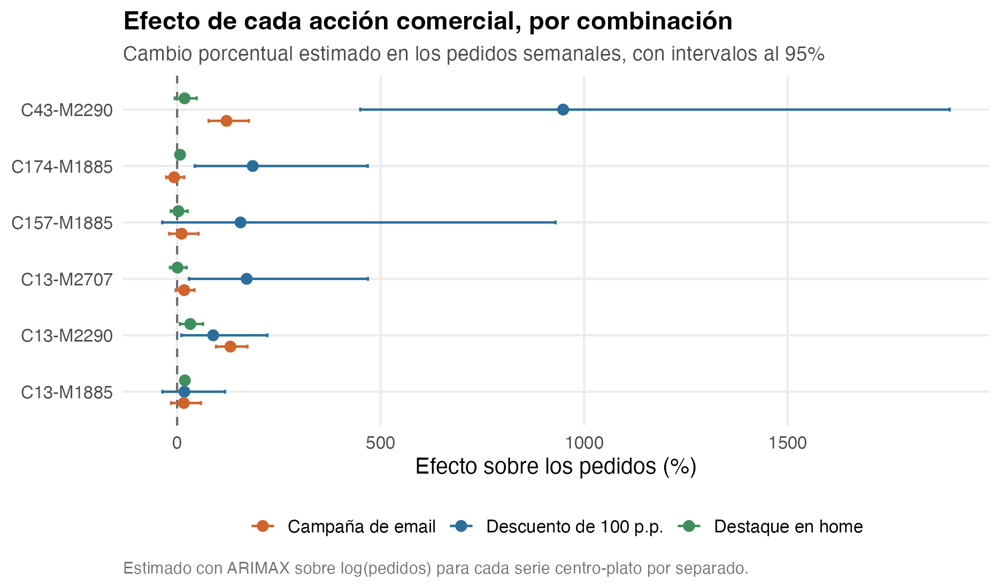{width=95%}

A nivel individual los efectos promocionales sí son económicamente grandes, y ahí
se ve por qué el agregado los diluye: para la combinación centro 43 / plato 2290
una campaña de correo se asocia a un aumento del 121% en los pedidos, mientras
que para el centro 174 / plato 1885 el efecto no se distingue de cero. La
heterogeneidad es enorme, y promediarla hace desaparecer la señal.

## Proyección final para las semanas 146 a 155

Con los criterios anteriores se reestiman los modelos usando las 145 semanas
completas y se proyectan las diez semanas siguientes. Los precios y promociones
de ese período provienen del archivo de test.

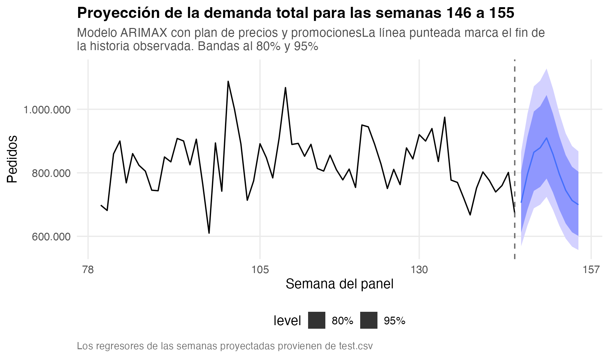{width=100%}

La demanda total proyectada promedia
`r n_fmt(mean(proy_tot$proyeccion[proy_tot$.model == "arimax"]))` pedidos
semanales, con un intervalo al 80% que en la primera semana proyectada va de
`r n_fmt(proy_tot$li80[proy_tot$.model == "arimax"][1])` a
`r n_fmt(proy_tot$ls80[proy_tot$.model == "arimax"][1])` pedidos. La amplitud del
intervalo, de alrededor de un tercio del valor central, es una medida de 
incertidumbre, y es información operativa en la medida que define 
el margen de seguridad con que conviene aprovisionar/planificar.

Interesa mirar cuánto cambia la proyección según se use o no el plan
comercial. Las diferencias semana a semana van de
`r n_fmt(min(dif_mod$diferencia_pct), 1)`% a
`r n_fmt(max(dif_mod$diferencia_pct), 1)`%. Es decir, aunque incorporar el plan
comercial no reduzca el error promedio a nivel agregado, **sí cambia
significativamente la proyección de semanas puntuales**, que son justamente aquellas en que la empresa planea una acción comercial fuera de lo habitual.

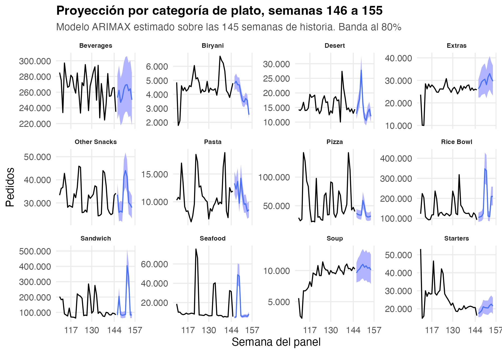{width=100%}

```{r}
#| label: tbl-proycat
#| tbl-cap: "Demanda proyectada por categoría para el conjunto de las diez semanas"
proy_cat |>
  mutate(across(c(total_10_semanas, promedio_semanal), n_fmt)) |>
  rename(Categoría = category, `Total 10 semanas` = total_10_semanas,
         `Promedio semanal` = promedio_semanal) |>
  kable(align = "lrr")
```

Éste es el entregable operativo: define cuánta materia prima aprovisionar por
familia de producto. Tres categorías (bebidas, bowls de arroz y sándwiches)
concentran el 78% del volumen proyectado, de modo que el esfuerzo de
planificación debería concentrarse ahí.

Como control de consistencia, se comparó la proyección agregada contra la
suma de las proyecciones por categoría. Acumuladas sobre las diez semanas
difieren en un 4,1%, mientras que las categorías excluidas del modelado
representan el 9,9% del volumen histórico: las dos vías son coherentes entre sí
dentro de lo que explica esa exclusión. Las diferencias semana a semana son
mayores, y corresponden al ruido de dos modelos estimados de forma independiente.

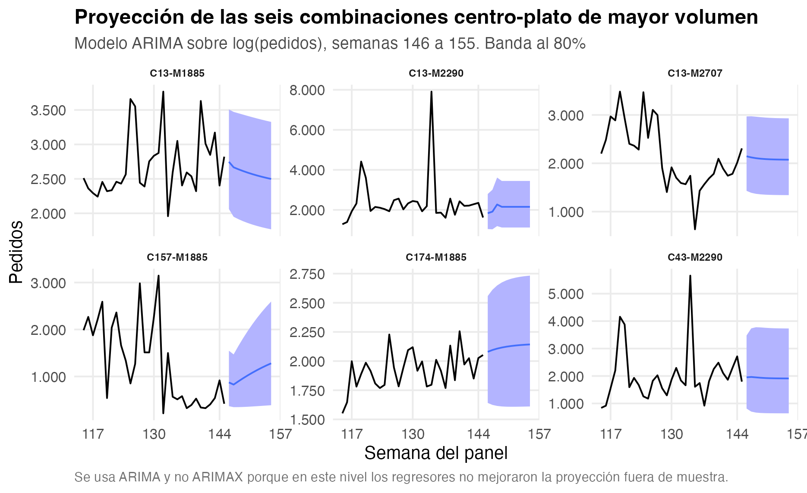{width=100%}

Para el nivel centro-plato se usa el modelo **sin** variables
exógenas, siguiendo la evidencia de la sección anterior.

\newpage

# Limitaciones del análisis

**Sobre el alcance de las conclusiones causales.** Los coeficientes estimados son asociaciones, no efectos causales. Y no son representativas en tanto las promociones y los descuentos no se asignan
al azar. Así, es razonable que la empresa promocione los platos cuya demanda espera
alta, lo que sesga los coeficientes al alza. El trabajo es de pronóstico, y para
pronosticar esa endogeneidad no es un problema, ya que interesa la capacidad
predictiva, no la identificación. Pero invalida interpretar los coeficientes como efectos causales del tipo: 
"si promocionáramos tanto más, venderíamos tanto más". Responder eso requiere
variación exógena en la asignación de promociones, o un diseño de panel con
efectos fijos que es justamente la técnica que aquí se descartó.

**Sobre la estacionalidad.** Con 2,8 ciclos anuales no se puede descartar que
exista estacionalidad y que la muestra sea demasiado corta para detectarla. La
conclusión correcta es que no hay evidencia de estacionalidad anual identificable
con estos datos, no que no exista. Un año más de historia podría cambiar esa
conclusión.

**Sobre el calendario.** El dataset no trae fechas reales, de modo que no es
posible incorporar feriados, eventos deportivos, clima ni estacionalidad de
calendario; variables que en la industria gastronómica suelen ser determinantes.
Es probablemente la limitación más severa: buena parte de la varianza residual que
el modelo no explica podría deberse a eventos de calendario que el dataset no
permite observar.

**Sobre la cobertura del modelado.** Se modelaron explícitamente el agregado, doce
categorías y seis combinaciones centro-plato; no las 3.597 series individuales
que pedía la competencia original. Extender el enfoque a todas ellas es directo
en términos de código pero requiere resolver el tratamiento de las series cortas
y discontinuas, y modelos de conteo para series de volumen bajo, donde la
aproximación normal en logaritmos deja de ser adecuada, y donde incluso algunos
métodos no pueden ser aplicados sin otros supuestos o transformaciones.

**Sobre la coherencia entre niveles.** Las proyecciones de los distintos niveles
se estimaron de forma independiente, de modo que no suman exactamente. La
literatura ofrece métodos de reconciliación de pronósticos jerárquicos que
imponen esa coherencia y que suelen mejorar la precisión de todos los niveles a
la vez. Junto con el punto anterior, constituyen la extensión natural de este trabajo.

**Sobre la dimensión intra-producto de la respuesta al precio.** El análisis
exploratorio mostró que la sensibilidad de la demanda al precio es un fenómeno de
cada producto consigo mismo: al controlar por la identidad de la combinación
centro-plato, el poder explicativo se multiplica por
`r n_fmt(elast$r2[2] / elast$r2[1], 1)`. Los modelos de este trabajo capturan esa
dimensión sólo de forma indirecta, estimando series por separado en cada nivel de
agregación. La herramienta natural para estimarla de manera explícita es un modelo
de panel con efectos fijos por combinación centro-plato, que es justamente la
técnica descartada en la Parte 1 por no producir proyecciones. En fin, la técnica que mejor identifica el efecto del precio no es la
que mejor responde la pregunta de negocio. Un trabajo más ambicioso usaría las dos de forma complementaria.

**Sobre la asimetría de la respuesta al precio.** El modelo trata el descuento de
forma lineal y simétrica, cuando es plausible que la demanda reaccione distinto a
una baja de precio que a un recargo. No se estimó una respuesta asimétrica porque
los datos no lo permiten: los recargos superiores al 2% son el
`r n_fmt(sum(concen$porcentaje[1:2]), 1)`% de las observaciones, masa insuficiente
para identificar una pendiente propia.

# Conclusiones

El trabajo construyó un sistema de pronóstico de demanda a diez semanas para una
red de 77 centros de distribución de comida, usando modelos ARIMA y ARIMAX sobre
145 semanas de historia, y respondió las dos preguntas planteadas en la Parte 1.

Sobre la **pregunta operativa**, el modelo seleccionado proyecta la demanda
semanal total con un error porcentual absoluto medio del
`r n_fmt(g(prec_cv, "arima_d0", "MAPE"), 1)`% en validación cruzada, frente al
`r n_fmt(g(prec_cv, "naive", "MAPE"), 1)`% del pronóstico ingenuo: una mejora de
alrededor de un cuarto del error. A nivel de categoría de producto, que es el
nivel en el que se decide la compra de insumos, el modelo con información
comercial alcanza un MASE promedio de `r n_fmt(res_cat$MASE_promedio[res_cat$.model == "arimax"], 2)`,
menos de la mitad del error de un pronóstico ingenuo. En conclusión, el sistema 
es utilizable para planificar aprovisionamiento de insumos y fuerza de trabajo.

Sobre la **pregunta econométrica** (cuánto aporta conocer el plan comercial)
la respuesta es reveladora: **aporta cuando y donde las palancas comerciales efectivamente se
mueven en el período proyectado**. En el agregado no aporta, porque la
empresa mantiene sus indicadores promocionales dentro de un rango estrecho de dimensiones. En el nivel de categoría aporta mucho, porque ahí las campañas se concentran y la
variación sobrevive. En el nivel de combinación individual (centro-plato) no aportó en este período concreto,nporque durante las diez semanas proyectadas no hubo campañas que aprovechar.

En conclusión, el análisis permite destacar dos observaciones. Primero, evaluar con una sola ventana de backtesting puede elegir el
modelo equivocado (en este caso, habría llevado a concluir que ningún modelo supera al
pronóstico ingenuo, lo que la validación cruzada desmiente). Segundo, el mejor ajuste dentro de la muestra no anticipa el mejor desempeño fuera de ella. El modelo con variables exógenas gana por amplio margen en criterio de información, pero no mejora la proyección agregada.

# Anexo --- Reproducibilidad {.unnumbered}

El repositorio contiene los datos, los scripts y este informe. El proyecto se
ejecuta completo desde la raíz del repositorio con `Rscript R/run_all.R`, que
regenera todas las figuras y tablas citadas. Todas las rutas son relativas y la
semilla aleatoria está fijada en 2026. Los scripts están numerados en el orden en que deben ejecutarse: preparación de datos, análisis exploratorio, modelado
agregado, modelado desagregado y proyección final.
